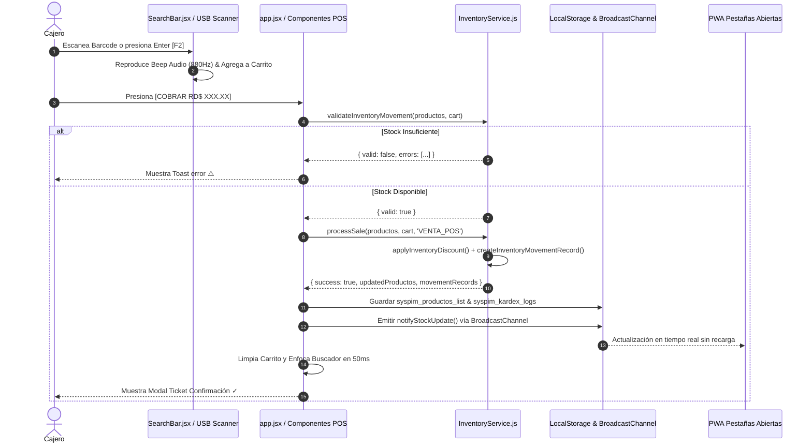

# 🗺️ MAPA MAESTRO DE ARQUITECTURA & HISTORIAL DE ACTUALIZACIONES
> **PROYECTO:** SYSPIM MARKET (SaaS Multi-Tenant de Colmados, Minimarkets & Delivery)  
> **FECHA DE ÚLTIMA ACTUALIZACIÓN:** 2026-07-27  
> **ESTADO DEL PROYECTO:** En Producción / Totalmente Funcional

---

## 📌 1. REGLA DE ORO PARA FUTURAS MODIFICACIONES
> ⚠️ **INSTRUCCIÓN PERMANENTE DE DESARROLLO:**  
> Antes de realizar cualquier cambio, ajuste visual o nueva funcionalidad en el código, **SIEMPRE DEBES CONSULTAR ESTE MAPA MAESTRO**. Ninguna actualización debe alterar o romper las estructuras base listadas en este documento.

---

## 🏛️ 2. ARQUITECTURA TÉCNICA DE REFERENCIA

### **Stack Tecnológico Core:**
* **Frontend UI:** HTML5 + JavaScript ES6+ + React 18 (Compilación nativa empaquetada con Vite).
* **Estilos & Diseño:** Tailwind CSS local (PostCSS + Autoprefixer + utility classes en `styles.css`).
* **Base de Datos & Realtime:** Supabase Cloud (Autenticación, tablas `pedidos`, `productos`, `tenants`, `clientes` y canales WebSocket / `BroadcastChannel`).
* **Capa de Dominio:** Servicios ES6 independientes (`src/services/`) desacoplados de la capa de presentación React.
* **Impresión Térmica:** Módulo `AdminModule.acceptAndPrintOrder` para impresoras térmicas de 80mm en solo texto.
* **Pruebas Automatizadas:** Suite de pruebas unitarias en Node.js ESM (`tests/inventoryService.test.js`).

---

### **Diagrama de Arquitectura por Capas:**

```mermaid
graph TD
    subgraph Capa 1: Presentación UI (React & MPA)
        UI1[src/app.jsx - Orquestador POS]
        UI2[src/components/POS/ - Subcomponentes POS]
        UI3[catalog.html - PWA Cliente Delivery]
        UI4[delivery.html - App Repartidores]
        UI5[superadmin.html - Panel SaaS Admin]
    end

    subgraph Capa 2: Servicios de Dominio (Pure ES6 Modules)
        S1[src/services/inventoryService.js]
        S2[src/utils/broadcast.js - Realtime Sync]
        S3[src/utils/helpers.js]
    end

    subgraph Capa 3: Persistencia y Tiempo Real
        P1[(Supabase Cloud Database)]
        P2[(LocalStorage - syspim_productos_list)]
        P3[(LocalStorage - syspim_kardex_logs)]
        P4[BroadcastChannel - syspim_orders_channel]
    end

    UI1 --> UI2
    UI1 --> S1
    UI3 --> S1
    UI1 --> S2
    S1 --> P2
    S1 --> P3
    S2 --> P4
    S1 -. Sincronización .-> P1
```

---

## 🛡️ 3. PRINCIPIOS FUNDAMENTALES DE DESARROLLO

1. **Desacoplamiento Estricto:** La capa de componentes React **NUNCA contiene reglas de negocio**. Toda la lógica de cálculo, descuento, validación o Kardex debe residir en la capa `src/services/`.
2. **Inmutabilidad de Datos:** Ninguna función modifica arreglos u objetos existentes. Las operaciones de inventario o estado devuelven copias inmutables creadas con spread operators (`...`).
3. **Auditoría Obligatoria Kardex:** Todo cambio de existencia en el inventario (ventas POS, compras PWA, reabastecimiento o ajustes) debe generar un registro de movimiento inmutable en `syspim_kardex_logs`.
4. **Validación Numérica Defensiva:** Antes de aplicar cualquier movimiento, se valida mediante `Number.isFinite()` que las cantidades sean mayores a 0 y no produzcan `NaN` ni desbordamientos.
5. **Identificación Unívoca en Producción:** La búsqueda y descuento de productos se realiza estrictamente por `id`/`uuid` o `barcode`. Las coincidencias por nombre son el último recurso defensivo.
6. **Sincronización Transaccional Multi-Pestaña:** Toda mutación de estado local debe ser persistida en `localStorage` e inmediatamente notificada a otras pestañas/ventanas PWA mediante `BroadcastChannel`.

---

## 🔄 4. FLUJO TRANSACCIONAL DE UNA VENTA (`processSale`)



---

## 📊 5. MATRIZ DE DEPENDENCIAS POR MÓDULO

| Módulo / Vista | Archivo Principal | Componentes / Servicios Requeridos | Responsabilidad |
| :--- | :--- | :--- | :--- |
| **POS Terminal** | `src/app.jsx` | `HeaderNav`, `SearchBar`, `CartTable`, `PaymentPanel`, `ShortcutBar`, `KardexModal`, `InventoryService` | Terminal de caja de cobro de alta velocidad sin ratón. |
| **Catálogo PWA** | `catalog.html` | `catalog-entry.jsx`, `InventoryService`, `broadcast.js` | Pedidos web para clientes a domicilio. |
| **App Repartidores** | `delivery.html` | `delivery-entry.jsx`, Supabase Realtime | Monitoreo y despacho de envíos. |
| **SuperAdmin SaaS** | `superadmin.html` | `superadmin.js`, Supabase Auth & Multi-tenant | Gestión de colmados, suscripciones y configuración. |
| **Servicio Inventario** | `src/services/inventoryService.js` | Módulo ES6 Puro | Dominio central de existencias, reglas Kardex y validaciones. |

---

## 📁 6. CONVENCIONES DE NOMENCLATURA Y ESTRUCTURA DE ARCHIVOS

- **Servicios de Dominio:** Ubicados en `src/services/`, nombrados en `camelCase` finalizados en `Service.js` (Ej. `inventoryService.js`, `orderService.js`).
- **Componentes React:** Ubicados en `src/components/`, nombrados en `PascalCase` con extensión `.jsx` (Ej. `SearchBar.jsx`, `CartTable.jsx`, `PaymentPanel.jsx`).
- **Utilidades Generales:** Ubicadas en `src/utils/`, nombradas en `camelCase` con extensión `.js` (Ej. `broadcast.js`, `helpers.js`).
- **Pruebas Unitarias:** Ubicadas en `tests/`, nombradas en `camelCase` finalizadas en `.test.js` (Ej. `inventoryService.test.js`).

---

## 🗺️ 7. ROADMAP ARQUITECTÓNICO Y EVOLUCIÓN

### **Versión 2.0 (Completado) ✅**
- [x] Desacoplamiento de la Capa de Dominio `InventoryService`.
- [x] Rediseño POS de Alta Velocidad (Square POS Style, Header 1-Fila, Buscador Dominante).
- [x] Modo Escáner USB con Beep Audio a 880Hz y autoFocus.
- [x] Modularización de la Interfaz del POS (`src/components/POS/`).
- [x] Suite de Pruebas Unitarias de Inventario (`npm run test`).
- [x] Modal de Auditoría e Historial de Movimientos Kardex (`KardexModal.jsx`).

### **Versión 3.0 (Planificado) 🚀**
- [ ] Módulo de Arqueo y Cierre de Caja (Control de turnos, descuadres y reportes de efectivo).
- [ ] Arquitectura Multi-Sucursal (Múltiples depósitos/almacenes por colmado).
- [ ] Sistema de Permisos y Roles de Usuario (Cajero, Administrador, Colmadero).
- [ ] Panel de Analítica Financiera (Margen de ganancia, productos estrella, ventas por hora).
- [ ] API REST Pública / Webhooks para integración con balanzas e impresoras fiscales.

---

## 🧩 3. MÓDULOS PRINCIPALES Y SU ESTRUCTURA

### 🛒 A. Terminal de Punto de Venta (POS Cajero - `src/app.js`)
* **Diseño Arquitectónico:** 2 Columnas Adheridas (70% Izquierda / 30% Derecha - Estándar SyspimFarma / Farmacia San José).
  * **Columna Izquierda (70%):**
    * **Buscador Superior Amplio:** Campo de entrada con margen interno amplio (`px-2 py-1`), tipografía grande `text-base / text-lg font-extrabold` que evita el recorte de letras.
    * **Autocompletado de Alta Legibilidad:** Menú desplegable amplio con borde azul de contraste, indicadores de `Stock (EA)`, categoría, precio y badge `Enter (1ro)`.
    * **Botones de Acción Rápida:** `⏸️ F8 Pausar`, `▶️ F9 Recup.`, `🗑️ Limpiar`.
    * **Tabla "Detalle de la Venta":** Columnas `PRODUCTO`, `EA` (Stock Existencia), `CANT.`, `PRECIO`, `TOTAL`, `ACCIÓN (✕)`. Desplazamiento automático hacia el último producto agregado al final de la lista.
  * **Columna Derecha (30% - Panel "RESUMEN DE COBRO"):**
    * **Banner Gigante "TOTAL A PAGAR RD$":** Tipografía `4XL` azul/teal.
    * **Selector de Método de Pago:** `💵 EFECTIVO`, `💳 TARJETA`, `📲 TRANSFER`.
    * **Calculadora de Efectivo & Devuelta:** Campo de entrada **Efectivo Recibido RD$ (F2)** con recuadro destacado de **DEVUELTA** con cálculo en tiempo real.
    * **Comprobante Fiscal (NCF):** Casilla `[ ] ¿Requiere Comprobante Fiscal (RNC)?` con campo desplegable para RNC / Cédula.
    * **Botón Principal:** `🧾 COBRAR E IMPRIMIR` de alto impacto.

---

### 🛵 B. Catálogo Digital del Cliente / PWA (`catalog.html`)
* **Diseño Arquitectónico:** App Móvil Estilo Delivery GO / E-Commerce.
  * **Header Superior Degradado:** Nombre del colmado activo (`DeliveryGO • COLMADO DON PEDRO`), dirección de envío editable (`📍`) e insignia de perfil.
  * **Barra de Búsqueda y Categorías Fijas (Sticky Header `sticky top-0 z-30`):** La lupa de búsqueda y las pestañas de categorías no se ocultan al desplazarse hacia abajo.
  * **Grilla de Productos:** Foto en alta definición, nombre, categoría, precio y botón azul `+` con contador flotante rojo por producto.
  * **Carrito Flotante Inferior Expandible (Bottom Cart Sheet):**
    * Panel fijado en la parte inferior cuando hay productos en el carrito (`cartCount > 0`).
    * Muestra resumen de subtotal e ítems.
    * Botón interactivo **`▲ Ver Productos Guardados`** que despliega una lista dentro de la pantalla para ajustar cantidades (`-` / `+`), eliminar artículos o vaciar el carrito.
    * Botón principal `📲 Solicitar Pedido a Domicilio →`.

---

### 📦 C. Inventario & Catálogo de Productos (`catalogoProductos`)
* Mantenimiento de más de 80 productos precargados divididos en categorías:
  * 🥛 **Lácteos & Huevos** (Rica Leche Listamilk, Descremada, Milex, Nido, Bravo, Huevos Frescos Cartón 30 Unid, etc.).
  * 🍎 **Frutas y Vegetales** (45+ rubros de mercado precargados: Plátano Verde, Guineo, Tomate Bugalú, Cebolla Roja, Papa, Aguacate, Ajo, etc.).
  * 🥤 **Bebidas & Refrescos** (Coca-Cola 2L, jugos, etc.).
  * 🍞 **Panadería & Abarrotes**.

---

### 👑 D. SuperAdmin SaaS Multi-Tenant (`src/modules/superadmin/superadmin.js`)
* Administración centralizada de múltiples colmados/tenants.
* Control de suscripciones, configuración de slugs y sucursales.

---

## 📜 4. HISTORIAL DE ACTUALIZACIONES (CHANGELOG)

### **[2026-07-28] - Syspim Market v2.0: Modularización POS, Auditoría Kardex & Suite de Pruebas Unitarias**
* **Modularización Arquitectónica de Componentes (`src/components/POS/`):**
  1. **`HeaderNav.jsx`:** Encabezado unificado de 1 sola fila con control de modulos, estado Online y botón de auditoría Kardex.
  2. **`SearchBar.jsx`:** Buscador estilo Square POS con autoFocus, beep de escáner USB a 880Hz y autocompletado con semáforo de 3 niveles.
  3. **`CartTable.jsx`:** Detalle de venta con botones atómicos de cantidad y cuadrícula **⚡ Venta Rápida 1-Tap (8 Favoritos)** para carritos vacíos.
  4. **`PaymentPanel.jsx`:** Total A Pagar en números gigantes (Azul `#0284C7`), chips de método de pago, devuelta y Botón Cobrar dinámico (Verde `#16A34A`).
  5. **`ShortcutBar.jsx`:** Banda inferior de atajos de teclado (`F2`, `Enter`, `F8`, `F9`, `ESC`).
  6. **`KardexModal.jsx`:** Modal visual e interactivo de auditoría para buscar, filtrar y examinar los logs de `syspim_kardex_logs`.
* **Suite de Pruebas Unitarias (`tests/inventoryService.test.js`):**
  1. **Pruebas Automatizadas (6/6 Pasadas al 100%):** Validación de existencias, descuentos inmutables, prevención de stock negativo, logs Kardex y orquestador `processSale`.
  2. **Script `npm run test`:** Añadido a `package.json` para ejecución automatizada en Node.js ESM.
* **Orquestación en `src/app.jsx`:** Refactorización masiva importando los submódulos especializados de `src/components/POS/`.

### **[2026-07-27] - Rediseño POS Alta Velocidad (Estilo Square POS), Capa de Dominio InventoryService y Escáner USB**
* **Capa de Dominio de Inventario (`src/services/inventoryService.js`):**
  1. **Servicio Desacoplado:** Creación del módulo de dominio `InventoryService` con reglas puras de negocio re-utilizables fuera de componentes React (`applyInventoryDiscount`, `applyInventoryIncrease`, `applyInventoryAdjustment`, `validateInventoryMovement` y `processSale`).
  2. **Búsqueda Estricta por ID/Barcode:** Identificación prioritaria por `id`/`uuid` y `barcode` eliminando colisiones y falsos positivos por nombres similares en producción.
  3. **Generación de Registros Kardex:** Función `createInventoryMovementRecord` que registra logs de auditoría de movimientos de inventario (`syspim_kardex_logs`) con stock anterior, stock nuevo, tipo (`VENTA_POS`, `VENTA_PWA`, `AJUSTE`) y timestamp.
  4. **Validación Numérica Defensiva:** Aserciones estrictas `Number.isFinite()` que garantizan que el stock nunca desborde ni se convierta en `NaN`.
* **Rediseño UI/UX POS Cajero de Alta Velocidad (`src/app.jsx`):**
  1. **Header Unificado de 1 Fila:** Combinación del logo, badge de colmado, estado `🟢 Online`, chips de módulos y menú secundario en una sola barra fija (`sticky top-0 z-40`), recuperando 70px de espacio vertical útil para la venta.
  2. **Buscador Dominante & Modo Escáner USB:** Buscador un 15% más alto con autofocus al entrar a la pantalla del POS. Soporte para lector de código de barras USB con **Beep sonoro de confirmación a 880Hz** mediante Web Audio API y re-enfoque instantáneo en 50ms para escaneo en ráfaga.
  3. **Venta Rápida 1-Tap (Favoritos):** Al no tener productos en el carrito, se despliega una cuadrícula interactiva de 8 productos frecuentes para vender al instante con 1 solo toque.
  4. **Jerarquía Cromática & Total A Pagar:** Banner de Total A Pagar con tipografía `text-5xl font-black` en Azul `#0284C7` y Botón `COBRAR RD$ XXX.XX` en Verde Esmeralda `#16A34A` dinámico.
  5. **Semáforo de Stock de 3 Niveles:** Badges de disponibilidad en autocompletado: 🟢 Stock alto (>10), 🟡 Stock bajo (4-10) y 🔴 Crítico / Sin Existencia (<=3).
  6. **Barra Footer de Atajos de Teclado:** Atajos clave destacados en la parte inferior del POS (`[F2] Buscar`, `[Enter] Agregar 1ro`, `[F8] Pausar`, `[F9] Recuperar`, `[ESC] Limpiar`).

### **[2026-07-26] - Migración Arquitectónica a Bundled App & Despliegue Producción Vercel**
* **Compilación & Despliegue en Producción Vercel (https://syspim-market-six.vercel.app):**
  1. **Despliegue Directo de Producción:** Publicación exitosa de la carpeta empaquetada `dist/` en Vercel asignando el dominio oficial `https://syspim-market-six.vercel.app`.
  2. **Eliminación del 100% de CDNs en tiempo real:** Removidas las cargas de `cdn.tailwindcss.com`, `@babel/standalone` y scripts UMD de React/ReactDOM en favor de compilación nativa en tiempo de build con Vite (`npm run build` en 2.27s).
  3. **Tailwind CSS Local & PostCSS:** Instalados y configurados `tailwindcss`, `postcss` y `autoprefixer` con directivas `@tailwind` en `styles.css` y reglas para ignorar avisos en IDE (`.vscode/settings.json`).
  4. **Puntos de Entrada ESM & MPA:** Creación de `src/main.jsx`, `src/catalog-entry.jsx`, `src/delivery-entry.jsx` e integración con `<script type="module">`.
  5. **Service Worker v3 (PWA & Offline):** `public/sw.js` actualizado a versión `v3` con estrategia *Network-First* que garantiza purga de código obsoleto.

### **[2026-07-26] - Sincronización Vercel / Localhost, Estrategia Anti-Caché & Favicon Assets**
* **Sincronización & Caché Vercel (vercel.json, index.html & sw.js):**
  1. Configuración de cabeceras anti-caché HTTP (`no-cache, no-store, must-revalidate`) en `vercel.json` y meta-tags en `index.html` para erradicar el desfasamiento ("divorcio") entre `localhost:3000` y las vistas desplegadas en Vercel CDN.
  2. Actualización del Service Worker (`sw.js`) a la versión `syspim-market-v2` pasando de *Cache-First* a estrategia **Network-First** con fallback a caché, garantizando descarga inmediata de las últimas actualizaciones de `src/app.js`.
  3. Limpieza de clases de `<body>` e `<html>` en `index.html` eliminando clases obsoletas de tema oscuro (`dark`, `bg-[#040a07]`) para alineación perfecta con el sistema de diseño claro *Clean Light Retail*.
  4. Creación del asset oficial `public/favicon.svg` (icono vectorial Cyan Retail `#0284C7`) y fallback `public/favicon.ico`, eliminando errores 404 en la consola del navegador.

### **[2026-07-26] - Rediseño POS 2 Columnas & Catálogo Delivery GO**
* **POS Cajero (src/app.js & admin.js):**
  1. Reestructuración completa a la arquitectura de 2 columnas de SyspimFarma (70% Detalle Venta / 30% Resumen Cobro).
  2. Implementación del banner `TOTAL A PAGAR RD$` en tamaño 4XL.
  3. Adición del campo `Efectivo Recibido (F2)` con caja verde de `DEVUELTA` en vivo.
  4. Incorporación del checkbox para Comprobante Fiscal (NCF/RNC).
  5. Desplazamiento automático al agregar productos (antiguos suben, nuevo aparece abajo).
  6. Desplegable de búsqueda ampliado con alta legibilidad y eliminación de recortes en la primera letra.
  7. Impresión térmica optimizada en tickets de 80mm sin imágenes.
* **Catálogo Digital PWA (catalog.html & src/app.js):**
  1. Transformación visual al estilo Delivery GO / Instacart / Bravo App con degradados, ubicación e insignias.
  2. **Header Adhesivo Unificado Fijo (`sticky top-0 z-40`):** Integra el nombre del colmado, la dirección de envío, la **Barra de Búsqueda con Lupa 🔍** y las pestañas de categorías dentro de un solo bloque fijo en la parte superior. La barra de búsqueda permanece 100% visible sin ocultarse al desplazarse en celular.
  3. Rediseño del catálogo en **Carruseles Horizontales Seccionados por Categoría** con desplazamiento táctil `scroll-snap-x mandatory`, encabezados con botón "Ver todos" y tarjetas de producto de ancho fijo (145px - 170px) con botón flotante `+`.
  4. **Venta al Detalle (Por Libras / Monto en RD$ / Unidades sueltas):** Módulo `DetailProductModal` para productos de colmado como Arroz, Carnes (Res, Pollo, Cerdo), Habichuelas, Víveres (Plátano, Guineo, Yuca), Sal, Salami y Queso. El cliente puede seleccionar entre **💵 Por Monto en Pesos** (ej. RD$ 50, RD$ 100, RD$ 200, RD$ 500) o **⚖️ Por Peso / Unidades** (ej. 0.5 lb, 1 lb, 2.5 lbs o 5, 10, 20 unid) con cálculo automático en tiempo real.
  5. Implementación del Carrito Flotante Inferior Expandible (Bottom Cart Sheet) que muestra los productos guardados con controles de incremento/decremento (`-` / `+`).
* **Imágenes de Inventario:**
  1. Generación de imágenes oficiales de producto para *Rica Leche Listamilk Lt* y *Rica Leche Descremada Lt*.
  2. Integración de 45+ productos agrícolas a la categoría *Frutas y Vegetales*.

---

## 🔐 5. PROTOCOLO DE VERIFICACIÓN ANTES DE CADA COMMIT
1. **Validación de Sintaxis JSX:** Ejecutar `node scratch/validate_jsx.js` para asegurar que todas las etiquetas JSX en `src/app.js` estén perfectamente cerradas.
2. **Prueba de Servidor Local:** Verificar que `npx serve` responda en puerto 3000 sin advertencias de consola.
3. **Revisión contra este MAPA MAESTRO:** Confirmar que no se hayan roto los componentes de POS 2 Columnas ni el Carrito Flotante en `catalog.html`.
